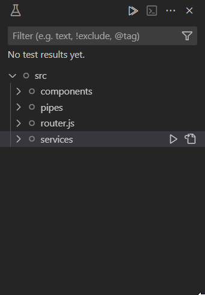
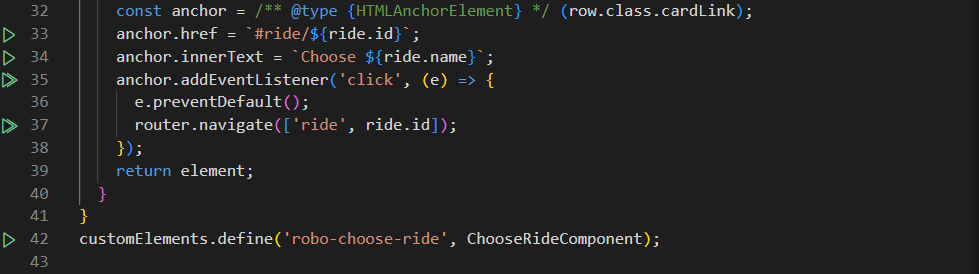

# Mutation Testing
This extension provides seamless integration with mutation testing frameworks that support the Mutation Server Protocol. For now, only [StrykerJS](https://stryker-mutator.io/docs/stryker-js/introduction/) supports this protocol.

With this extension, you can run mutation tests directly within Visual Studio Code. It allows you to quickly identify weak spots in your codebase, helping improve the overall quality and effectiveness of your tests.

## What is mutation testing?
Mutation testing involves introducing bugs (mutants) into your code, then running your tests for each mutant. The goal is to see if your tests can "kill" the mutant by causing the test to fail. If the test passes despite the mutation, the mutant survives, which may indicate that your tests aren't fully covering the code. A higher percentage of killed mutants suggests more effective and comprehensive tests.

[Learn more about mutation testing](https://stryker-mutator.io/docs/) in general for a deeper understanding of the process.

## Features

### Test Explorer Integration
Effortlessly navigate through mutants in your project via the Test Explorer view. Find mutants and run mutation tests per folder, per file or individually. Get visual feedback on the status of mutants within your code and easily navigate to mutants in your codebase directly from the Test Explorer.

### Code annotations
Easily test mutations right where they're written using the test icon in your code editor. You'll see the status of each tested mutation right next to your code. Plus, with the code diff view, you can quickly spot the changes Stryker made to your code.

## Requirements
To use this extension, ensure that you have a mutation testing tool set up in your project. You can configure this in the extension settings if you're using a framework that supports the Mutation Server Protocol.

## Extension Settings
This extension contributes the following settings:

// TODO

## Troubleshooting
We’d love to get your help in making this extension better! If you have feedback or encounter any problems, please reach out on our [GitHub repository](https://github.com/stryker-mutator/editor-plugins).
